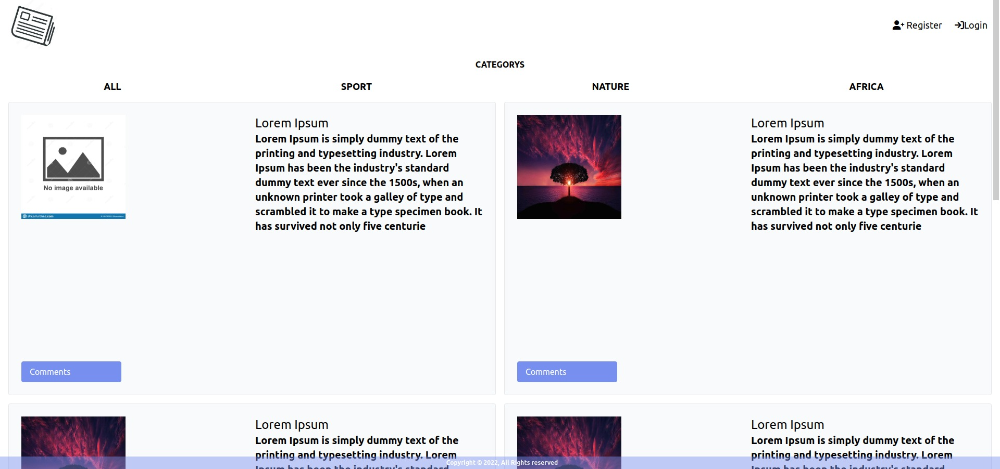
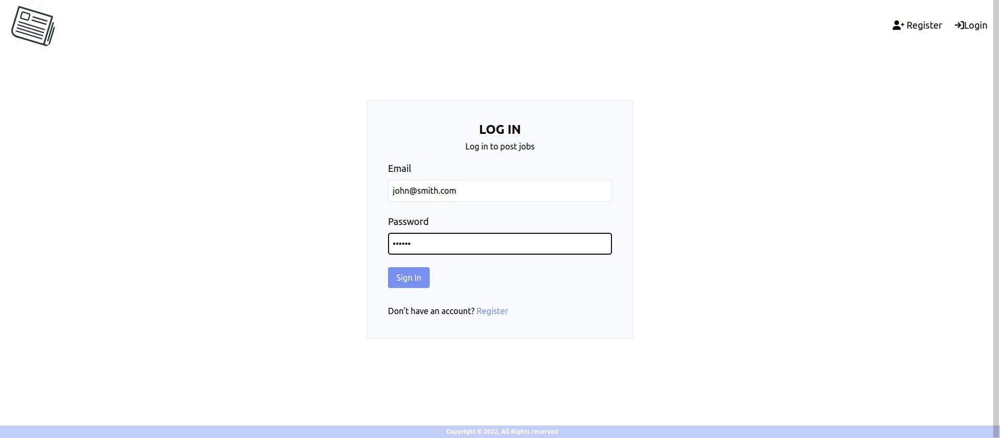
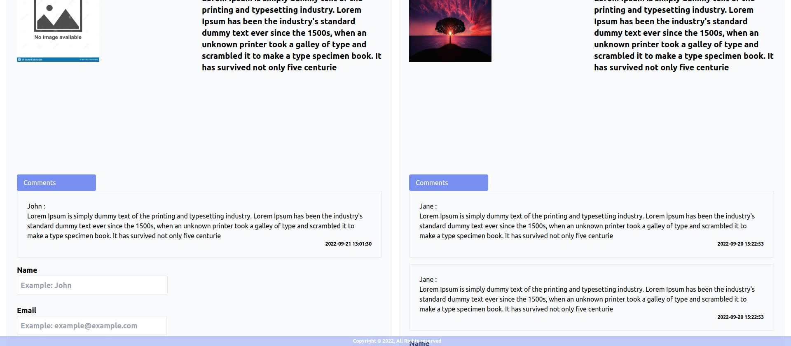
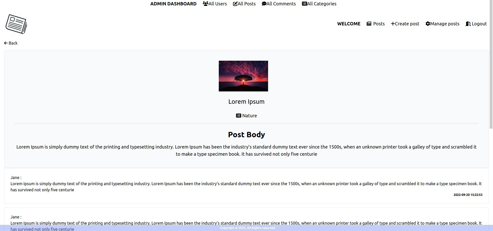

# News App for ITC

# Used PHP/PHP Extensions For Laravel and etc/Laravel/MySql/Alpine.js/jQuery

## Application for posting and commenting with administration section

## This app is only for demonstration purposes only!

---

## Public Main Page




---

## Login 



---

## Comments



---

## Single Post 



---

## Admin Management and more ...


---


# Requirements:

### Git 
### Code Editor PHPSTORM or any other
### Mysql or any other database for information storing
### PHP
### PHP Extensions For Laravel and etc

---

# How To Set up:

## Execute commands specified in terminal successfully:

### 1. Clone or download with Git to your chosen directory

### 2. In your chosen directory open terminal
#### Terminal should be open in chosen directory root!

### 3. Open chosen directory with your chosen editor.

### 4. Rename .env.example file from your chosen directory root to .env in same directory.

### 5. Next fill the renamed .env file from your core directory with your credentials:
#### DB_HOST=your_mysql_ip_address
#### DB_DATABASE=your_databases_name
#### DB_USERNAME=your_mysql_database_username
#### DB_PASSWORD=your_mysql_database_password if is set if not leave empty

### 6. Run composer to install required packages

```
composer install
```

#### if a command failed because of requirements try this command instead

```
composer install --ignore-platform-reqs
```

### 7. Generate app key

```
php artisan key:generate
```

### 8. Migrate database migrations to fill your database with all the necessary tables and columns:

```
php artisan migrate
```

### 9. Populate database with required users table and categories table

```
php artisan db:seed
```

### 10. Run the App command:

````
php artisan serv
````

### 11. Open your browser and navigate to http://127.0.0.1:8000:
#### or if in your terminal is written different address navigate to it in your favorite web browser
#### or for shortcut press ctrl and left mouse button in your terminal on your generated address should open browser with served page


### 12. Register in register page to make posts, comments are public with any name and email. 

### 13. Demo admin account login for administration:

##### login
````
john@smith.com
````
##### password
````
123456
````
#### Or set admin mode in your database:   in users table:   in isAdmin field:   fill with digit:1 or 0 if is not admin

## Enjoy!

---

#### Default images are located in public/images:
#### newsicon.png for favicon and navicon
#### no-image.jpg for alternative image as if there is no image
